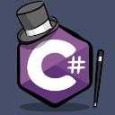

# Инструкция по работе с MarkDown

## Выделение текста

* __Жирный__

* **Тоже жирный**

* *Курсив*

* _Тоже курсив_

* ~~Зачеркнутый~~

```C#
string s = "C#";
MessageBox.Show($"Лучший язык:{s}");
```

## Списки и отступы

- Пункт 1

или

+ Пункт 2

или

* Пункт 3

или

1. Пункт 1

или

1. Пункт 1

1. Пункт 2

1. Пункт 3

или даже

9. Пункт 1

5. Пункт 2

1. Пункт 3

## Работа с изображениями


## Ссылки

Git [STGorbunovDA](https://github.com/STGorbunovDA) с тайтлом.

[STGorbunovDA](http://example.net/) без заголовка.

<https://github.com/STGorbunovDA; – а это безанкорная ссылка.


## Работа с таблицами и чек-боксами

| Language      | Branch | Checked |        
| ------------- |:-------------:|:-------------:|
| Java Script      | javascript  |  &#9744;   |
| C++      | cpp      | &#9744;   |
| C# | C Sharp      | &#9745; |
| Markdown | md      | &#9744;   |

| Unchecked | Checked |
| --------- | ------- |
| &#9744;   | &#9745; |

## Цитаты

> Цитаты задаются угловой скобкой.
> Это строка является частью цитаты.

Здесь цитата прерывается.

> Можно писать много-много текста, и он автоматически всё преобразует в одну цитату. Также можно использовать различные *начертания* в **цитате**.


